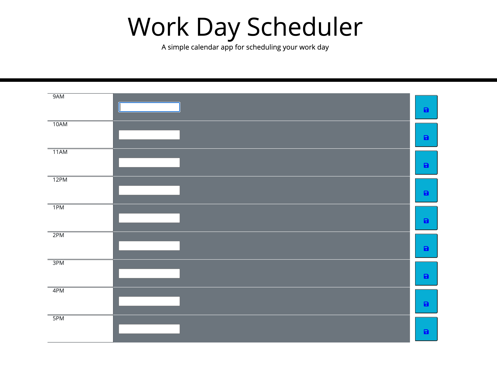

    
  

  
  ## Table Of Contents
  |   |       | |
| ------------- |:-------------:| -----:|
| [E-mail](#email)| [Project Title](#Project-title)| [Description](#description)|
| [Installation](#installation)| [Usage](#usage)| [License](#license)|
| [Contribute](#contribute)| [Tests](#tests)| [Questions](#questions)|
  

  ## Email 
  idelmundo@gmail.com
  

      
  ## Project title 
 Day Planner
  

  ## Description 
  In this project we are making a day planner for user to input schdule, timeblocks during business hours. I had a hard time doing this and will most likely do this homework over once i get more time. 
  

  ## Installation 
  html, css, and JS
  

  ## Usage 
  N/A
  

  ## License 
  MIT
  

  ## Contribute
  Github
  

  ## Tests 
  js
  

  ## Questions 
  
  

  
        